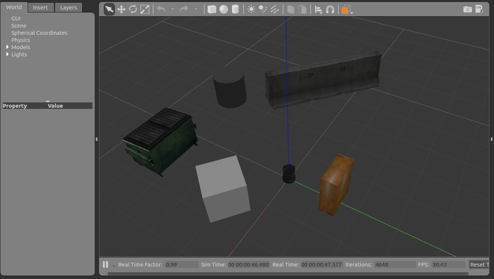
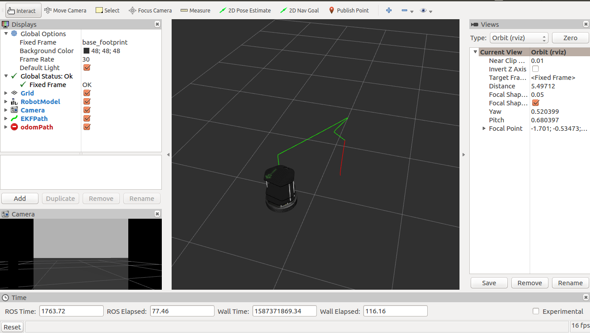

# Extended_kalman_filter
Implementaion of Extended Kalman filter to estimate the robot's pose using sensor fusion (wheel encode, IMU and camera sensor) in the gazebo world.
In the end, you will be able to drive the robot around in simulation and observe the Odom and EKF trajectories

## Ros packages used:
1. turtlebot_gazebo
2. robot_pose_ekf
3. odom_to_trajectory
4. turlebot_teleop
5. rviz

## Steps to Launch the Simulation
### step 1 Steps to Launch the Simulation
```
$ mkdir -p /home/workspace/catkin_ws/src
$ cd /home/workspace/catkin_ws/src
$ catkin_init_workspace
$ cd ..
$ catkin_make
```

### Step 2 Perform a System Update/Upgrade
```
$ apt-get update
$ apt-get upgrade -y
```
### Step 3 Clone the Package in src
```
$ cd /home/workspace/catkin_ws/src
$ git clone https://github.com/mahendraseervi/Extended_kalman_filter.git
```
### Step 4 Edit the main.launch file
```
Delete this: <node pkg="rviz" type="rviz" name="rviz" args="-d /home/mahendra/catkin_ws/src/EKFLab.rviz"/>
Replace with: <node pkg="rviz" type="rviz" name="rviz" args="-d /home/yourworkspace/catkin_ws/src/EKFLab.rviz"/>
```
### Step 5 Install Packages Dependancies
```
$ cd /home/workspace/catkin_ws/
$ source devel/setup.bash
$ rosdep -i install turtlebot_gazebo
$ rosdep -i install turtlebot_teleop
```
### Step 6 Build the Packages
```
$ catkin_make
$ source devel/setup.bash
```
### Step 7 Launch the main file
```
$ roslaunch main main.launch
```
Now, you should see Gazebo and rviz launching. Please note that Gazebo might take up to 3 min to launch!

## Images :
### Turtlebot world :


### visualization in rviz :



